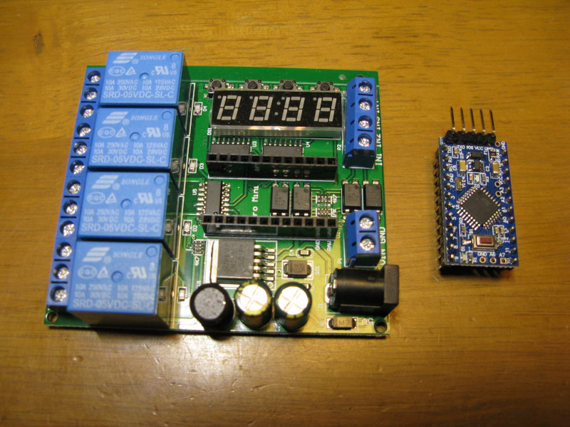

# OpenPLC_for_IO22C04
I modified the <a href="https://www.openplcproject.com/">OpenPLC</a> developed by Thiago Alves and published as Opensource for Eletechsup <a href="https://ja.aliexpress.com/item/32787988935.html?spm=a2g0s.12269583.0.0.3eb11dd3khJARD">IO22C04</a>. 
My Blog : <a href="https://blog.goo.ne.jp/soratobu_macaronipenguin/e/7546370ee95c4076bedf8d2031c82bd0">https://blog.goo.ne.jp/soratobu_macaronipenguin</a>

